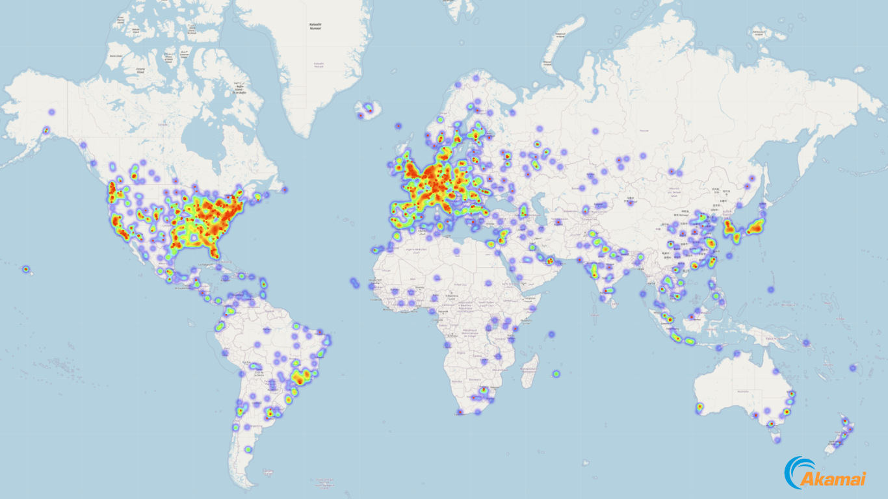

# CryptominersAnalysisTools

A collection of tools for analyzing cryptominer activity. This repository is part of the Cryptominers' Anatomy blog series by Maor Dahan. The tools were published in conjunction with the blog posts, with usage instructions and real-world use cases provided directly from the research.

Using these tools, you can adopt the attacker's mindset to track down cryptominer campaigns. In addition to hunting campaigns, you can use the tools to detect malicious mining activities within your systems and ultimately fight back to mitigate the attacker's grip on your resources.

## Candidate Table ([Part I](https://www.akamai.com/blog/security-research/2025-february-cryptominer-anatomy-internals))

This component generates a candidate table that lists the most relevant cryptocurrencies an attacker might target for cryptomining malware. The coins are ranked by profitability using a formula that considers both the reward per mined block and the network hashrate, predicting the chances of winning the block mining race relative to the botnet's size and computing power.

Example output where the most relevant coins are privacy-focused and ASIC resistant:

```
Name                     | Algorithm    | Privacy Coin | ASIC resistant | KHR Profit
------------------------------------------------------------------------------------
SUMO                     | CryptoNightR |      No      |      Yes       | 0.00029647
FNNC                     | YescryptR16  |      No      |      Yes       | 0.00021125
Yerbas                   | GhostRider   |      No      |      Yes       | 0.00020158
RTM                      | GhostRider   |     Yes      |      Yes       | 0.00013138
FSC                      | GhostRider   |      No      |      Yes       | 0.00009290
Kylacoin                 | Flex         |      No      |      Yes       | 0.00007729
LCN                      | Flex         |      No      |      Yes       | 0.00007559
SPRX                     | YesPoWer     |      No      |      Yes       | 0.00004781
Monero                   | RandomX      |     Yes      |      Yes       | 0.00003965
Quantum Resistant Ledger | RandomX      |      No      |      Yes       | 0.00002945
Pascal                   | RandomHash2  |      No      |      Yes       | 0.00001978
XMC                      | CryptoNight  |      No      |       No       | 0.00001740
XELIS                    | XelisHash    |      No      |      Yes       | 0.00000289
Babacoin                 | GhostRider   |      No      |      Yes       | 0.00000096
GBX                      | NeoScrypt    |     Yes      |      Yes       | 0.00000091
Litecoin                 | Scrypt       |     Yes      |       No       | 0.00000076
GSPC                     | GhostRider   |      No      |      Yes       | 0.00000069
Frog Coin                | BMW512       |      No      |      Yes       | 0.00000044
PLUS1                    | HMQ1725      |      No      |      Yes       | 0.00000038
ZOC                      | NeoScrypt    |      No      |      Yes       | 0.00000015
VGC                      | X16Rv2       |      No      |      Yes       | 0.00000012
Zephyr                   | RandomX      |     Yes      |      Yes       | 0.00000003
Avian                    | X16RT        |      No      |      Yes       | 0.00000002
DIME                     | Quark        |      No      |       No       | 0.00000002
Actinium                 | Lyra2z       |      No      |      Yes       | 0.00000001
Verus                    | VerusHash    |     Yes      |      Yes       | 0.00000001
EFL                      | Scrypt       |      No      |       No       | 0.00000000
Dogecoin                 | Scrypt       |      No      |       No       | 0.00000000
Arion                    | X11          |      No      |       No       | 0.00000000
Dash                     | X11          |     Yes      |       No       | 0.00000000
BOLI                     | X11          |      No      |       No       | 0.00000000
BTB                      | Scrypt       |      No      |       No       | 0.00000000
HAL                      | NeoScrypt    |      No      |      Yes       | 0.00000000
NOVO                     | SHA256DT     |      No      |       No       | 0.00000000
Sumokoin - exchanges: 1 - markets: 1
Raptoreum - exchanges: 6 - markets: 9
Monero - exchanges: 31 - markets: 59
XMC - exchanges: 3 - markets: 4
Zephyr - exchanges: 9 - markets: 15
Verus - exchanges: 3 - markets: 6
```

## Blockchain Network Crawler ([Part II](https://www.akamai.com/blog/security-research/cryptominer-analyzing-samples-active-campaigns))

This tool crawls blockchain networks based on the Cryptonote P2P protocol, with a focus on Monero-like blockchains. It can, however, be generalized to any decentralized proof-of-work blockchain. The crawler outputs a list of known node peers (publicly accessible nodes) and generates a world map displaying these nodes with geolocation and heat map overlays.

### Quick Usage

There is a preset configuration for Monero and Safex. You may also use the `custom` option for other Cryptonote-based networks.

Run the following command to get started:

```
python ./blockchain_network_crawler/main.py monero
```

Command-line help output:

```
usage: main.py [-h] [-n NODE] [-p PORT] [--network-id NETWORK_ID] [--cleanup] {monero,safex,custom}

A blockchain network crawler for networks based on the Cryptonote P2P protocol, such as Monero.

positional arguments:
  {monero,safex,custom}
                        Select the network you want to crawl.

options:
  -h, --help            Show this help message and exit.
  -n NODE, --node NODE  Specify the IPv4 address of a seed node.
  -p PORT, --port PORT  Specify the port number of the seed node.
  --network-id NETWORK_ID
                        Provide the hex string ID of the network.
  --cleanup             Clean up cached files.
```

### Geo-Location Map of Nodes

The tool generates an HTML file that overlays blockchain nodes on a world map.

Example result: 


## Acknowledgments

Akamai data science department for **insightful** data.

## License

Copyright 2025 Akamai Technologies Inc.

Licensed under the Apache License, Version 2.0 (the "License");
you may not use this file except in compliance with the License.
You may obtain a copy of the License at

    http://www.apache.org/licenses/LICENSE-2.0

Unless required by applicable law or agreed to in writing, software
distributed under the License is distributed on an "AS IS" BASIS,
WITHOUT WARRANTIES OR CONDITIONS OF ANY KIND, either express or implied.
See the License for the specific language governing permissions and
limitations under the License.